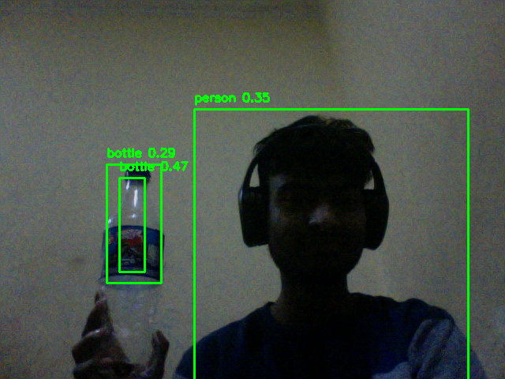

# 🤖 SmartVision-AI

SmartVision-AI is a real-time object detection system built using **YOLOv3-Tiny** and **OpenCV**.  
It uses a live webcam feed to detect objects like **persons** and **cell phones**, and takes simple decisions based on detections.

---

## 🚀 Features

- 🎥 Real-time object detection using webcam  
- ⚡ YOLOv3-Tiny for fast and efficient inference  
- 🛑 Person detection → **STOP decision**  
- 📱 Cell phone detection → **ALERT decision**  
- 🧠 Simple decision logic (beginner-friendly)  
- 🐍 Built completely in Python  

---

## 🛠️ Tech Stack

- Python 3.11  
- OpenCV (cv2)  
- YOLOv3-Tiny  
- NumPy  

---

## 📁 Project Structure
SmartVision-AI/ │── main.py                 # Main detection script │── coco.names              # Class labels │── yolov3-tiny.cfg         # YOLO config file │── yolov3-tiny.weights     # YOLO trained weights │── requirements.txt        # Python dependencies │── README.md               # Project documentation └── screenshots/ └── demo.png             # Demo output image

---

## 📸 Demo
## 📸 Demo

Below is a sample output from the real-time object detection system:


---

## ⚙️ Installation & Setup

### 1️⃣ Clone the repository
```bash
git clone https://github.com/Prince822-droid/SmartVision-AI.git
cd SmartVision-AI

pip install -r requirements.txt
python main.py

📌 Make sure your webcam is connected before running the script.

🎮 Controls
Press Q → Quit the application
📌 Notes
This project is built for learning and practice purposes
Can be extended to real robotics and AI surveillance systems
👨‍💻 Author
Prince Kumar (Prince822-droid)
Beginner ML | Computer Vision | Python Developer
⭐ If you like this project, don’t forget to star the repository!
---

## ✅ AB KYA KARNA HAI (SIMPLE)

1️⃣ GitHub pe `README.md` edit page kholo  
2️⃣ **Poora purana content delete**  
3️⃣ Upar wala **poora box paste**  
4️⃣ Niche jaake **Commit changes** dabao  

---
